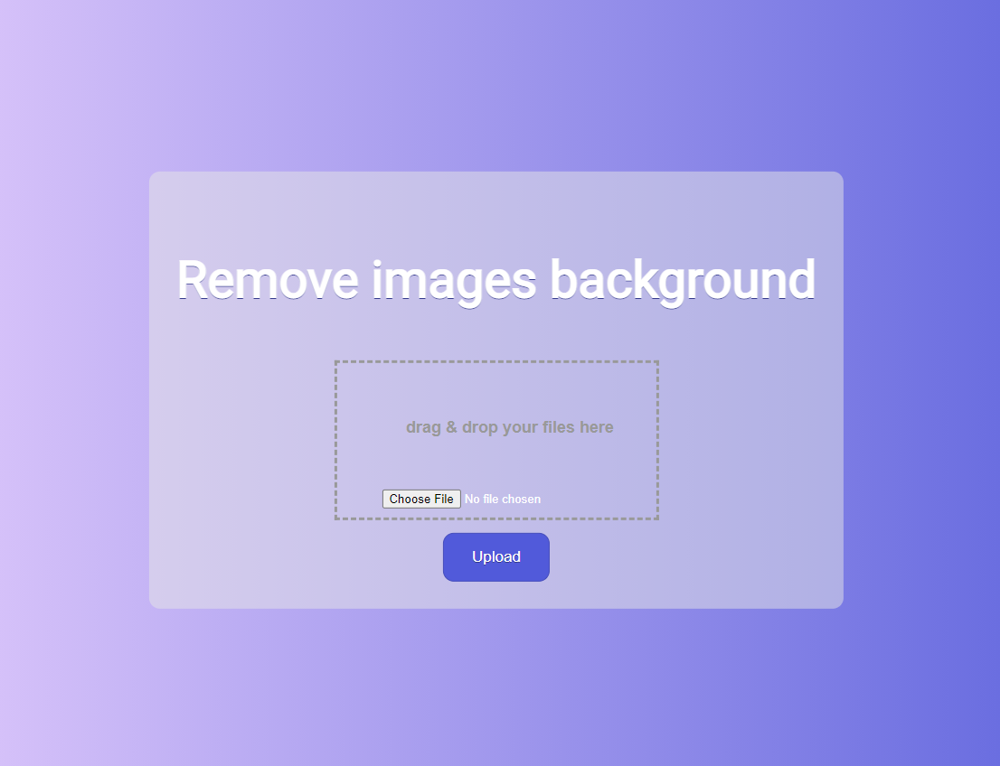

# rembg-webui
Simple webui for rembg. Uses AI to remove background from images.

## Clone, build and run
```
git clone https://github.com/turbosnute/rembg-webui.git
cd rembg-webui
sudo docker-compose up
```

## Use
Browse to http://localhost:5000

## Screenshot
